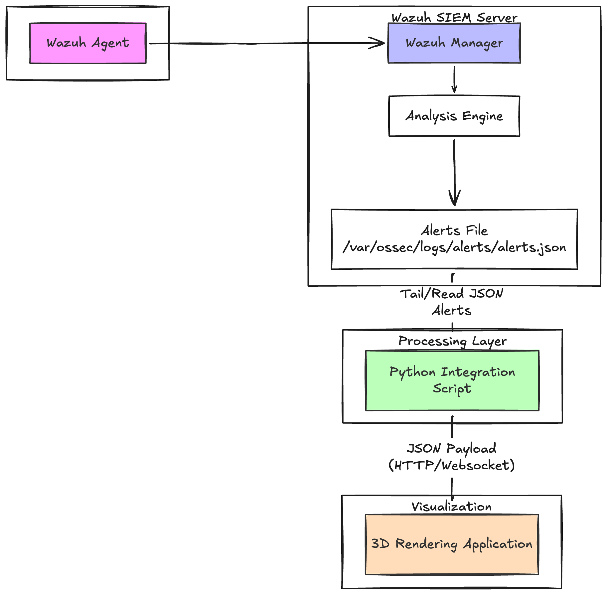

# Objective #

This project connects **SIEM**, open-source security monitoring and threat detection platform, with **Blender**, a 3D creation software.

Security alerts generated by Wazuh are retrieved as **JSON events**, processed with **Python**, and then used to drive a Blender scene.

# Technologies #

- **Wazuh** — security monitoring and threat detection
- **Docker / Docker Compose** — Wazuh infrastructure
- **Python** — event processing and communication
- **Blender** — 3D visualization
- **JSON** — event format
- **Raspberry Pi 5** — Wazuh server
- **Windows11 Computer** — Python and Blender environment

# Workflow #

|    Machine     |                Role                 |
|:--------------:|:-----------------------------------:|
| Raspberry Pi 5 |             Hosts Wazuh             |
|      Windows11       |       Runs Python and Blender       |
| Local network  | Communication between both machines |